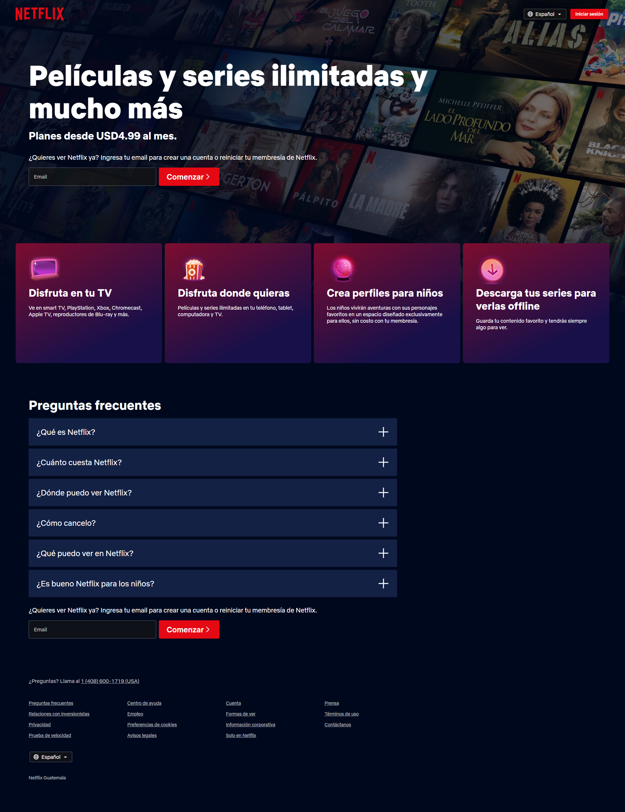
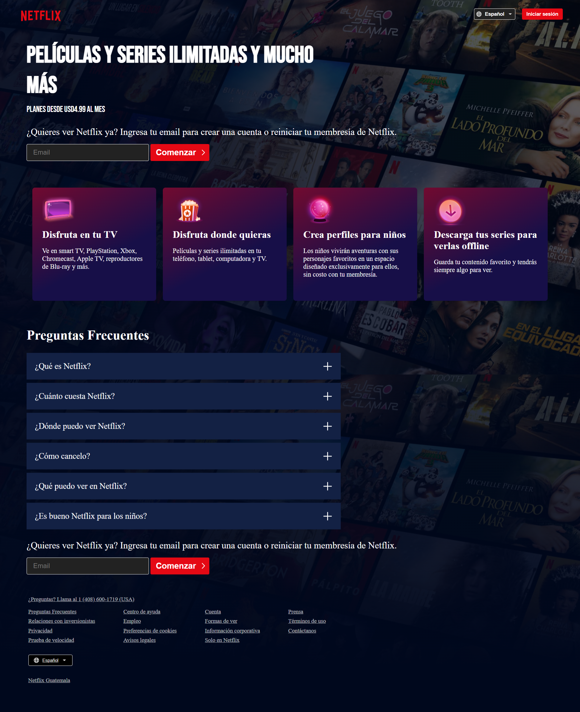

<h1 align="center" style="font-size: 3em;">Netflix Home Page Clone</h1>

Proyecto 1  
Sistemas y Tecnologías Web  
Universidad del Valle de Guatemala 2023  
Javier Alejandro Azurdia Arrecis | 21242  

<h2 style="font-size: 1.5em;">
    Tecnologías que se utilizaron
</h2>
<ul style=" column-count: 2; column-gap: 4em;">
    <li>HTML</li>
    <li>CSS</li>
    <li>JavaScript / React</li>
    <li>Node.js</li>
    <li>Vite</li>
    <li>ESLint</li>
    <li>Prettier</li>
</ul>
<h2 style="font-size: 1.5em;">
    Tests
</h2>
<ul style=" column-count: 2; column-gap: 4em;">
    <li>Storybook</li>
    <li>Vitest</li>
</ul>

Se implementó React
 
Se implementó Eslint con las reglas airbnb y prettier
 
Se implementó css modules
 
Se describieron las tecnologías usadas en el Readme.md
 
Se implementó Storybook
 
Se implementó Vitest
 

    Página original
  

 
Pagina Creada
  

